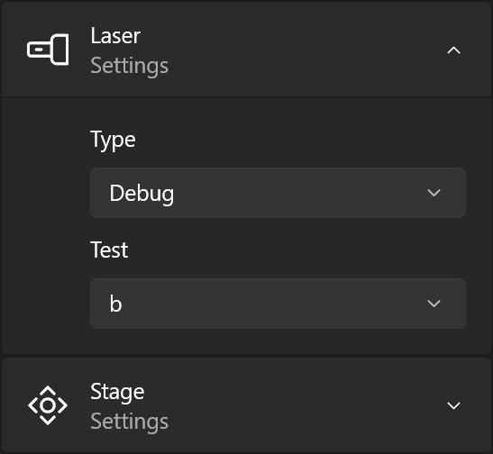
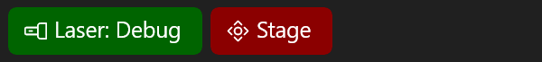

# Experiment Framework

This framework is specifically made for apps controlling physical experiments.

Its purpose is to manage external components and provide a layer of abstraction which makes switching between different implementations (devices surving a specific purpose, for example different lasers) easy.

## Example usage

For a working example (including the UI components), see the [TestApp](TestApp).

```c#
ExperimentContainer Components = new();
```

Add component classes:
```c#
Components.AddComponentClass<LaserComponent>();
Components.AddComponentClass<StageComponent>();
```

Add all available implementations:
```c#
Components.AddComponent<FakeLaser>();
Components.AddComponent<OtherLaser>();
Components.AddComponent<LaserOfChoice>();
Components.AddComponent<FakeStage>();
```

Make the component settings persistent:
```c#
Components.UseWinUISettingsStore();
Components.LoadFromSettings();
```

Initialize a component (if not anyway being done by `LoadFromSettings` or by the [ExperimentSettings](#experimentsettings) component):
```c#
Components.ActivateComponentAsync(typeof(LaserComponent), null, typeof(FakeLaser).Name, new FakeLaserSettings());
```

Get & use a component:
```c#
var laser = Components.GetActiveComponent<LaserComponent>();
laser.IsOn = true;
```

Get notified on component changes:
```c#
// either (for a specific component):
Components.AddComponentChangeHandler<LaserComponent>((newLaser) => { ... });
// or (for all component changes):
Components.ComponentChanged += (componentClass, id, newComponent) => { ... };
```

## WinUI 3 components

The framework comes with a few WinUI components:

### ExperimentSettings
Displays controls to change between different component class implementations and change their respective settings:



### ExperimentStatusBar
Shows a statusbar which displays all loaded components and their state:


